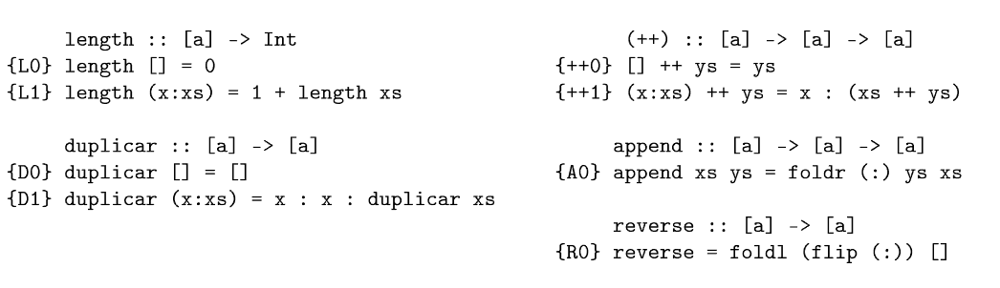

# Ejercicio 1

## I

```haskell
{I0} intercambiar (x, y) = (y, x)
```

$\forall p :: (a, b)$ intercambiar (intercambiar $p$) = $p$

Para demostrar esta igualdad, usamos el principio de extensionalidad funcional: 
$(\forall p::(a, b), f \ p = g \ p)$ entonces $f = g$. Donde $f$ y $g$ son el lado izquierdo y el lado derecho de la ecuación respectivamente

Como $p$ es un par, por lema de generación, $p :: (a, b)$ entonces $\exist x \in a, y \in b : p=(x,y)$  

Ahora demostremos $\forall p :: (a, b)$ intercambiar (intercambiar $p$) = $p$. Desarrollando el lado izquierdo de la ecuación:

```haskell
        intercambiar (intercambiar (x, y)) 
{IO} = intercambiar (y, x)
{IO} = (x, y)
```

Nos queda efectivamente el lado derecho de la ecuación. Queda demostrado.

## II

```haskell
{a0} asociarD ((x,y),z) = (x,(y,z))
{a1} asociarI (x,(y,z)) = ((x,y),z)
```

$\forall p::(a,(b,c))$ asociarD (asociarI $p$) $= p$

Aqui también usaremos el principio de extensionalidad funcional para probar la igualdad, y el lema de generación para la estructura de pares: 

$\{LG\}$ $(\exist x \in a, y \in b, z \in c) : p = (x, (y, z))$

Desarrollando el lado derecho de la ecuación:

```haskell
        asociarD (asociarI p)
{LG} = asociarD (asociarI (x, (y, z)))
{a1} = asociarD ((x, y), z)
{a0} =  (x, (y, z))
```

Obtenemos el lado izquierdo. Queda demostrado la propiedad.

## III

```haskell
{e0} espejar (Left x) = Right x
{e1} espejar (Right x) = Left x
```
Queremos demostrar

$(\forall p::$ Either a b $)$ espejar (espejar p) = p$

Por lema de generación sobre $p$: 
$\{LG\}$ $(\exist x \in a, y \in b) :$ o bien $p =$ Left $x$ o bien $p =$ Right $y$

Demotraremos la propiedad usando el principio de extencionalidad funcional separando en los casos de $p$.

> Caso $p =$ Left $x$
> ```haskell
>        espejar (espejar p)
> {LG} = espejar (espejar Left x)
> {e0} = espejar Right x
> {e1} = Left x
> {LG} = p
>```

> Caso $p =$ Right $x$
> ```haskell
>        espejar (espejar p)
> {LG} = espejar (espejar Right x)
> {e1} = espejar Left x
> {e0} = Right x
> {LG} = p
>```

Queda demostrado la propiedad

## IV

```haskell
{f0} flip f x y = f y x
```

Queremos demostrar

$(\forall f::a\rightarrow b \rightarrow c) \ (\forall x::a) \ (\forall y::b)$ flip (flip f) x y = f x y

Por principio de extensionalidad, basta con demostrar que para todo posible $f, x, y$ ambos lados de la ecuacion generar lo mismo.

(En cada paso deberiamos poner los para todos, pero para no escribir tanto lo omito (lo mismo para los demas ejercicios)).

```haskell
        flip (flip f) x y
{f0}  = flip f y x
{f0}  = f x y
```

Queda demostrado la propiedad.

## V

```haskell
{c0} curry f x y = f (x,y)
{c1} uncurry f (x,y) = f x y
```

Queremos demostrar

$(\forall f::a\rightarrow b \rightarrow c)  \ (\forall x::a) \ (\forall y::b)$ curry (uncurry f) x y = f x y

Nuevamente usaremos el principio de extensionalidad para demostrar la igualdad.

```haskell
       curry (uncurry f) x y = f x y
{c1} = curry ((x,y) -> f x y) x y
{c0} = f x y
```

otra forma

```haskell
                   curry (uncurry f) x y = f x y
{c0}             = (uncurry f) (x, y)
{asoc a izq}     = uncurry f (x, y)
(c1)             = f x y
```

# Ejercicio 2

Principio de extensionalidad funcional: 
Sean $f, g :: a \leftarrow b$
Si $(\forall x::a) \ f \ x = g \ x$ entocnes $f = g$

## I

```haskell
{c} (g . f) x = g (f x)
{f} flip f x y = f y x
{id} id x = x

```


```haskell
flip :: (a -> b -> c) -> b -> a -> c
(.) :: (d -> e) -> (f -> g) -> f -> e
(flip . flip) :: (b -> a -> c) -> (b -> a -> c)
```

renombrando las variables y (des)agrupando a derecha (por el operador ->) tenemos:
```haskell
(flip . flip) :: (a -> b -> c) -> (a -> b -> c)
(flip . flip) :: (a -> b -> c) -> a -> b -> c
```

Aplicamos el principio de extensionalidad funcional. Basta ver que $\forall f::a \rightarrow b \rightarrow c \ \forall x::a \ \forall y::b$ se cumple la igualdad flip .flip f x y = id f x y


```haskell
        flip . flip f x y
{c}   = flip (flip f x y)
{f}   = flip f y x
{f}   = f x y
{id}  = id f x y

```

## II

```haskell
f :: (a,b) -> c
curry :: ((a, b) -> c) -> a -> b -> c
uncurry :: (a -> b -> c) -> (a, b) -> c

uncurry (curry f) = f :: (a, b) -> c

{c0} curry f x y = f (x,y)
{c1} uncurry f (x,y) = f x y
```


Aplicamos el principio de extensionalidad funcional. Basta ver que $\forall p=(x,y)$ con $x\in a \wedge y \in b$ se cumple la igualdad $uncurry (curry f) (x,y) = f (x,y)$

```haskell
         uncurry (curry f) (x, y)
{c1}   = curry f x y
{c0}   = f (x, y)

```

## III

flip const = const id

```haskell
flip :: (a -> b -> c) -> b -> a -> c
const :: a -> b -> a

flip const :: b -> a -> a

{f} flip f x y = f y x
{c} const x y = x
{id} id x = x
```

Nuevamente usamos el principio de extensionalidad de funciones: $\forall x\in a, \forall y \in b$
qvq flip const y x = const id y x 

```haskell
        flip const y x
{f}   = const x y
{c}   = x
{id}  = id x
{c}   = (const id y) x
      = const id y x
```

## IV

Usando principio de extensionalidad de funciones $\forall x \in a$ basta con probar que 
((h . g) . f) x = (h . (g . f)) x

```haskell
{d} (.) f g x = f (g x)
```

```haskell
                 ((h . g) . f) x
{d}           = (h . g) (f x)
{d}           = h (g (f x))
{d}           = h (g . f) x
{d}           = (h . (g . f)) x
```

# Ejercicio 3



## I

$P(xs) \equiv \forall xs::[a]$ length (duplicar xs) = 2 * length xs

Por inducción estructural en xs basta ver que la propiedad se cumple en sus constructores:

> caso base $P([])$

```haskell
  length (duplicar [])  
= length ([])                   {D0}
= 0                             {L0}

  2 * length []
= 2 * 0                         {L0}
= 0
```

Al desarrollar ambos las de la ecuación obtenemos el mismo resultado. Probando que vale la propiedad para el caso base.

Otra forma de probar el caso base:

```haskell
  length (duplicar [])          {D0}
= length ([])                   {L0}
= 0                             
= 2 * 0                         {L0}
= 2 * length []                 
```

> caso inductivo $(\forall x::a, \forall xs::[a]) \ P(xs) \rightarrow P(x:xs)$

qvq $length (duplicar (x:xs)) = 2 * length (x:xs)$

```haskell
  length (duplicar (x:xs))              {D1}
= length (x : x : duplicar xs)          {L1}
= 1 + length (x : duplicar xs)          {L1}
= 1 + 1 + length (duplicar xs)          {HI}
= 2 + 2 * length xs                     
= 2 * (1 + length xs)                   {L1}
= 2 * length (x:xs)
```

Queda asi demostrado la propiedad

## II

$P(XS) \equiv \forall xs::[a] \ \forall ys::[a]$ length (xs ++ ys) = length xs + length ys

Inducción en la estructura de xs

> caso base $P([])$

```haskell
  length ([] ++ ys)     {++0}
= length (ys)
= 0 + length (ys)       {L0}
= length [] + length ys
```

> caso inductivo $(\forall x::a, \forall xs::[a]) \ P(xs) \rightarrow P(x:xs)$

qvq $length ((x:xs) ++ ys) = length (x:xs) + length ys$

```haskell
  length ((x:xs) ++ ys)         {++1}
= length (x : (xs ++ ys))       {L1}
= 1 + length (xs ++ ys)         {HI}
= 1 + length xs + length ys     {L1}
= length (x:xs) + length ys

```

## III

$P(XS) \equiv \forall xs::[a], \forall x::a$, [x] ++ xs = x:xs

Inducción en la estructura de xs

```haskell
{FR0} foldr f z [] = z
{FR1} foldr f z (x:xs) = f x (foldr f z xs)                   
```


qvq $[x] ++ [] = x:[]$

> caso base $P([])$

```haskell
  [x] ++ []                     {A0}
= foldr (:) [] [x]              {FR1}
= (:) x (foldr (:) [] [])       {FR0}
= (:) x []
= x : []
```

> caso inductivo $(\forall x::a, \forall xs::[a]) \ P(xs) \rightarrow P(x:xs)$

qvq $[x] ++ (y:ys) = x:(y:ys)$

```haskell
  [x] ++ (y:ys)                 {a0}
= foldr (:) (y:ys) [x]          {FR1}
= (:) x (foldr (:) (y:ys) [])   {FR0}
= (:) x (y:ys)
= x : (y:ys)
```

## IV

$P(XS) \equiv \forall xs::[a]$

Inducción en la estructura de xs

> caso base $P([])$
```haskell

```


> caso inductivo $(\forall x::a, \forall xs::[a]) \ P(xs) \rightarrow P(x:xs)$
```haskell

```
## V

$P(XS) \equiv \forall xs::[a]$

Inducción en la estructura de xs

> caso base $P([])$
```haskell

```


> caso inductivo $(\forall x::a, \forall xs::[a]) \ P(xs) \rightarrow P(x:xs)$
```haskell

```
## VI

$P(XS) \equiv \forall xs::[a]$

Inducción en la estructura de xs

> caso base $P([])$
```haskell

```


> caso inductivo $(\forall x::a, \forall xs::[a]) \ P(xs) \rightarrow P(x:xs)$
```haskell

```

## VII

$P(XS) \equiv \forall xs::[a]$

Inducción en la estructura de xs

> caso base $P([])$
```haskell

```


> caso inductivo $(\forall x::a, \forall xs::[a]) \ P(xs) \rightarrow P(x:xs)$
```haskell

```


# Ejercicio 4

## I

Por principio de extensionalidad sobre listas, basta con probar que 
$\forall xs::[a]$ ```reverse xs = foldr (\x rec -> rec ++ (x:[])) xs```

Y para ello usamos inducción estructural sobre la lista xs

> caso base 

```haskell
        foldl :: (b -> a -> b) -> b -> [a] -> b
{FL0}   foldl f z [] = z
{FL1}   foldl f z (x:xs) = foldl f (f z x) xs

        foldr :: (a -> b -> b) -> b -> [a] -> b 
{FR0}   foldr f z [] = z
{FR1}   foldr f z (x:xs) = f x (foldr f z xs)      


--qvq
reverse [] = foldr (\x rec -> rec ++ (x:[])) [] []

```

Desarrollamos ambos lados de la ecuación

```haskell
  reverse []                    {R0}
= foldl (flip (:)) [] []        {FL0}
= []
```

```haskell
  foldr (\x rec -> rec ++ (x:[])) [] []
= []                                            {FR0}
```


> caso inductivo

```haskell
-- HI
reverse xs = foldr (\y rec -> rec ++ (y:[])) [] xs

--- qvq ∀ xs::[a], x::a
reverse (x:xs) = foldr (\y rec -> rec ++ (y:[])) [] (x:xs)
```

```haskell
  foldr (\y rec -> rec ++ (x:[])) [] (x:xs)                                     {FR1}
= (\x rec -> rec ++ (y:[])) x (foldr (\y rec -> rec ++ (y:[])) [] xs)           {evaluamos el primer lambda}
= (foldr (\y rec -> rec ++ (y:[])) [] xs) ++ (x:[])
= (foldr (\y rec -> rec ++ (y:[])) [] xs) ++ [x]                                {HI}
= reverse xs ++ [x]                                                             {R0}
= foldl (flip (:)) [] xs ++ [x]                                                 {Lema 1}
= foldl (flip (:)) [x] xs                                                       
= foldl (flip (:)) ((flip (:) [] x)) xs                                         {FL1}
= foldl (flip (:)) [] (x:xs)                                                    {R0}                      
= reverse (x:xs)                                                                                       
```

> Lema 1
```haskell
-- foldl (flip (:)) [] xs ++ ys = foldl (flip (:)) ys xs

-- Caso base xs = []

  foldl (flip (:)) [] [] ++ ys          {FL0}
= [] ++ ys                              {++0}
= ys

  foldl (flip (:)) ys []                {FL0}
= ys

-- caso inductivo

-- hi: foldl (flip (:)) [] xs ++ ys = foldl (flip (:)) ys xs

-- qvq foldl (flip (:)) [] (x:xs) ++ ys = foldl (flip (:)) ys (x:xs)

  foldl (flip (:)) [] (x:xs) ++ ys                              {FL1}
= foldl (flip (:)) ((flip (:)) [] x) xs ++ ys                   
= foldl (flip (:)) [x] xs ++ ys                                 {HI}
= foldl (flip (:)) [] xs ++ [x] ++ ys                           {++1, ++0}
= foldl (flip (:)) [] xs ++ x:ys                                {HI, podemos por que la inducción vale para cualquier ys}
= foldl (flip (:)) x:ys xs                                      
= foldl (flip (:)) ((flip (:)) ys x) xs
= foldl (flip (:)) ys (x:xs)

```

## II

Usando inducción estructural sobre xs quermos ver que 

```haskell
∀ xs::[a] . ∀ ys::[a] . reverse (xs ++ ys) = reverse ys ++ reverse xs
```

> caso base ∀ ys::[a] P([], ys)

```haskell
-- qvq reverse ([] ++ ys) = reverse ys ++ reverse []

  reverse ([] ++ ys)
= reverse ys                      {++0}


  reverse ys ++ reverse []
= reverse ys ++ foldl (flip (:)) [] []         {R0}
= reverse ys ++ []                             {R0}
= foldl (flip (:)) [] ys ++ []                 {Lema 1, inciso I}
= foldl (flip (:)) [] ys                       {R0}
= reverse ys
```

> caso inductivo ∀ xs::[a] (∀ys::[a] P(xs, ys)) ⇒ (∀ ys::[a] P(x:xs, ys))

```haskell
--- HI: ∀ys::[a] reverse (xs ++ ys) = reverse ys ++ reverse xs

--- qvq: ∀ys::[a] reverse ((x:xs) ++ ys) = reverse ys ++ reverse (x:xs)

  reverse ((x:xs) ++ ys)                                  {++1}
= reverse (x:(xs ++ ys))                                  {R0}
= foldl (flip (:)) [] (x:(xs ++ ys))                      {FL1}
= foldl (flip (:)) (flip (:) [] x) (xs ++ ys)             
= foldl (flip (:)) [x] (xs ++ ys)                         {Lema 1, inciso I}
= foldl (flip (:)) [] (xs ++ ys) ++ [x]                   {R0}
= reverse (xs ++ ys) ++ [x]                               {HI}
= reverse ys ++ reverse xs ++ [x]                         {R0}
= reverse ys ++ foldl (flip (:)) [] xs ++ [x]             {Lema 1, inciso I}
= reverse ys ++ foldl (flip (:)) [x] xs                   {FL1}
= reverse ys ++ foldl (flip (:)) (flip (:) [] x) xs       {FL1}
= reverse ys ++ foldl (flip (:)) [] (x:xs)                {R0}
= reverse ys ++ reverse (x:xs)
```

## III

Usando lema de generación e inducción estructural sobre xs quermos ver que 

```haskell
∀ xs::[a]  ∀ y::a  reverse (xs ++ [y]) = y:reverse xs
```

> caso base P([])

```haskell
-- qvq: ∀ y::a  reverse ([] ++ [y]) = y:reverse []

  reverse ([] ++ [y])                       {++0}
= reverse [y]                               {R0, FL1, FL0}
= [x]


  x:reverse []
= y:[]
= [y]
```

> caso inductivo ∀ x::a ∀ xs::[a] (∀ y::a P(xs, y)) ⇒ (∀ y::a P(x:xs, y))

```haskell
-- HI: reverse (xs ++ [y]) = y:reverse xs
-- qvq: reverse ((x:xs) ++ [y]) = y:reverse (x:xs)

  reverse ((x:xs) ++ [y])                                   {R0}
= foldl (flip (:)) [] ((x:xs) ++ [y])                       {FL1}
= foldl (flip (:)) (flip (:) [] x) (xs ++ [y])          
= foldl (flip (:)) [x] (xs ++ [y])                          {lema 1, inciso I}
= foldl (flip (:)) [] (xs ++ [y]) ++ [x]                    {R0}
= reverse (xs ++ [y]) ++ [x]                                {HI}
= y:reverse xs ++ [x]                                       {asociatividad de ++}
= y:(reverse xs ++ [x])                                     {lema 2}
= y:(reverse (x:xs))
```

> lema 2
```haskell
-- reverse xs ++ [x] = (reverse xs ++ [x]) 

  reverse xs ++ [x]                         {R0}
= foldl (flip (:)) [] xs ++ [x]             {Lema 1, inciso I}
= foldl (flip (:)) [x] xs                   {FL1}
= foldl (flip (:)) (flip (:) [] x) xs       {FL1}
= foldl (flip (:)) [] (x:xs)                {R0}
= reverse (x:xs)

```

# Ejercicio 6

```haskell
     zip :: [a] -> [b] -> [(a,b)]
{Z0} zip = foldr (\x rec ys ->
                        if null ys
                            then []
                            else (x, head ys) : rec (tail ys))
                        (const [])

-- se puede ver mas claro como que foldr devuelve funciones de tipo  [b] -> [(a,b)]

{Z0} zip = foldr (\x rec -> (ys ->
                        if null ys
                            then []
                            else (x, head ys) : rec (tail ys)))
                        (const [])

-- foldr :: Foldable t => (a' -> b' -> b') -> b' -> t a' -> b'
-- en este caso a' = [a], b' = [b] -> [(a, b)]
-- luego el tipo de zip es [a] -> [b] -> [(a, b)]

{Z'0} zip' [] ys = []
{Z'1} zip' (x:xs) ys = if null ys then [] else (x, head ys):zip' xs (tail ys)

```

Veamos que zip = zip' usando el principio de extensionalidad e inducción estructural sobre la lista xs.
Queremos ver que ∀ xs::[a] zip xs = zip' xs

Por lema de generación xs es de la forma [] o (x:xs)

> caso base P([])
> 
```haskell

zip' [] ys = []                                                            {Z'0}

  zip [] 
= foldr (\x rec ys -> if null ys
                        then []
                        else (x, head ys) : rec (tail ys))
        (const []) 
        [] ys                                                             {FR0}
= const [] ys                                                             {const}
= []            
```

> caso inductivo ∀ x::a ∀ xs::[a] (∀ ys::[a] P(xs, ys)) ⇒ (∀ ys::[a] P(x:xs, ys))

```haskell
-- HI: zip xs ys = zip' xs ys
-- qvq: zip (x:xs) ys = zip' (x:xs) ys

-- sea f = (\x' rec ys' -> if null ys' then [] else (x', head ys') : rec (tail ys'))

-- vamos a tener que separar en casos para ys

-- caso ys = []

  zip' (x:xs) []                                                    {Z'1}
= []

  zip (x:xs) []                                                     {Z0}
= foldr f (const []) (x:xs) []                                      {FR1}
= f x (foldr f (const []) xs) []                                    {evaluamos f}
= if null []
    then []
    else (x, head ys) : (foldr f (const []) xs) (tail ys)           {rama true del if}
= []       


-- caso ys = (z:zs)
  zip' (x:xs) (z:zs)                                                            {Z'1}
= if null (z:zs) then [] else (x, head (z:zs)):zip' xs (tail (z:zs))            {rama false del if}
= (x, head (z:zs)) : zip' xs (tail (z:zs))
= (x, z) : zip' xs zs                                                           {HI}
= (x, z) : zip xs zs                                                            {Z0}
= (x, z) : foldr f (const []) xs zs                                             {f rama else}
= f x (foldr f (const []) xs) (z:zs)                                            {FR1}
= foldr f (const []) (x:xs) (z:zs)                                              {zip}
= zip (x:xs) (z:zs)
```


# Ejercicio 7

## I

Verdadera

Usando lema de generación e inducción estructural sobre la lista xs. 

```haskell
Eq a => ∀ xs::[a] . ∀ e::a . ∀ p::a -> Bool . elem e xs && p e = elem e (filter p xs)

         filter :: (a -> Bool) -> [a] -> [a]
{F0}    filter [] = []
{F1}    filter p (x:xs) = if p x then x : filter p xs else filter p xs


        elem :: Eq a => a -> [a] -> Bool
{E0}    elem e [] = False
{E1}    elem e (x:xs) = (e == x) || elem e xs
```

> caso base  ∀ e::a . ∀ p::a -> Bool  P([], e, p)

```haskell
-- qvq: elem e [] && p e = elem e (filter p [])

  elem e [] && p e
= False && p e
= False

  elem e (filter p [])
= elem e []
= False 
```

> caso inductivo ∀ x::a ∀ xs::[a] (∀ e::a . ∀ p::a -> Bool P(xs, e, p)) ⇒ (∀ e::a . ∀ p::a -> Bool P(x:xs, e, p))

```haskell
-- HI:  elem e xs && p e = elem e (filter p xs)
-- qvq: elem e (x:xs) && p e = elem e (filter p (x:xs))

-- caso p x == True

  elem e (x:xs) && p e                                  {E1}
= ((e == x) || elem e xs) && p e                        {distributiba &&}
= ((e == x) && p e) || (elem e xs && p e)               {HI}
= (e == x && p e) || elem e (filter p xs)          

  elem e (filter p (x:xs))                              {F1, con p x true}
= elem e (x : filter p xs)                              {E1}
= (e == x) || elem e (filter p xs)                      

-- basta con ver que (e == x && p e) = (e == x)

-- caso e == x, por congruencia p(e) = p(x) = True
(e == x && p e) = True && True = True
(e == x) = True
-- caso e != x   
(e == x && p e) = False
(e == x) = False

-- caso p x = False
  elem e (x:xs) && p e                                  {E1}
= ((e == x) || elem e xs) && p e                        {distributiba &&}
= ((e == x) && p e) || (elem e xs && p e)               {HI}
= (e == x && p e) || elem e (filter p xs)               {(e == x && p e) siempre False}
= elem e (filter p xs)

  elem e (filter p (x:xs))                              {F1, con p x false}
= elem e (filter p xs)                                  

-- (e == x && p e) siempre False
-- caso e == x, por congruencia p(e) = p(x) = False
True && False = False

-- caso e != x
False && p e = False
``` 

## II

Verdadero

Usando lema de generación e inducción estructural sobre listas

```haskell
Eq a => ∀ xs::[a] . ∀ e::a . elem e xs = elem e (nub xs)

-- Devuelve una lista sin elementos repetidos
     nub :: Eq a => [a] -> [a]
{N0} nub [] = []
{N1} nub (x:xs) = x : filter (\y -> x /= y) (nub xs)


     elem :: Eq a => a -> [a] -> Bool
{E0} elem e [] = False
{E1} elem e (x:xs) = (e == x) || elem e xs
```
> caso base  ∀ e::a P([], e)

```haskell
  elem e []                     {E0}
= []
    
    
  elem e (nub [])               {N0}
= elem e []                     {E0}
= []
```

> caso inductivo ∀ xs::[a] (∀ e::a P(xs, e)) ⇒ (∀ e::a P(x:xs, e))

```haskell
-- HI: elem e xs = elem e (nub xs)
-- qvq: elem e (x:xs) = elem e (nub (x:xs))

  elem e (x:xs)                                     {E1}
= (e == x) || (elem e xs)                           {HI}
= (e == x) || elem e (nub xs)
    
  elem e (nub (x:xs))                                               {N1}
= elem e (x : filter (\y -> x /= y) (nub xs))                       {E1}
= (e == x) || elem e filter (\y -> x /= y) (nub xs)                {Inciso I}
= (e == x) || elem e (nub xs) && ((\y -> x /= y) e)           

-- caso e == x, vemos ambas ecuaciones:

  (e == x) || elem e (nub xs)
= True || elem e (nub xs)
= True

  (e == x) || elem e (nub xs) && ((\y -> x /= y) e)           {evaluar e en la func lambda}
= (e == x) || elem e (nub xs) && (x /= e)                     {e == x}
= True || elem e (nub xs) && False
= True

-- caso e /= x
  (e == x) || elem e (nub xs)                                 {e /= x}
= elem e (nub xs)

  (e == x) || elem e (nub xs) && ((\y -> x /= y) e)             {evaluar e en la func lambda}
= (e == x) || elem e (nub xs) && (x /= e)                     {e /= x}
= False || elem e (nub xs) && True
= elem e (nub xs)

-- Para ambos casos ambas ecuaciones son equivalentes. Queda demostrada la hipotesis inductiva, y la propiedad.

```

## III

## IV

## V

## VI


# Ejercicio 10

```haskell
data AB a = Nil | Bin (AB a) a (AB a)

-- La funcion del primer parametro recibe por parametro el nodo actual, el resultado de la recursion del sub-arbol izq y el del sub arbol derecho
        foldAB :: (a -> b -> b -> b) -> b -> AB a -> b
{FAB0}  foldAB _ z Nil = z
{FAB1}  foldAB f z (Bin x1 x2 x3) = f x2 (foldAB f z x1) (foldAB f z x3)

        altura :: AB a -> Int
{A}     altura arbolBin = foldAB (\_ i d -> 1 + max i d) 0 arbolBin

        cantNodos :: AB a -> Int
{CN}    cantNodos arbolBin = foldAB (\_ i d -> 1 + i + d) 0 arbolBin

∀ x::AB a altura x ≤ cantNodos x
```

Vamos a demostrar la propiedad usando lema de generación e inducción estructural sobre AB

> caso base P(Nil)

```haskell

  altura Nil                                            {A}
= foldAB (\_ i d -> 1 + max i d) 0 NIL                  {FAB0}
= 0

  cantNodos Nil                                         {CN}
= foldAB (\_ i d -> 1 + i + d) 0 Nil                    {FAB0}
= 0
```

> caso inductivo ∀ izq, der :: AB a   (P(izq) ∧ P(der)) ⇒ (∀ e::a P(Bin izq e der))

```haskell
-- HI:  ∀ i, d :: AB a,  altura i ≤ cantNodos d && altura i ≤ cantNodos d
-- qvq: ∀ e::a  altura Bin i e d ≤ cantNodos i e d

  cantNodos Bin i e d                                           {CN}
= foldAB (\_ i d -> 1 + i + d) 0 (Bin i e d)                    {FAB1}
= f e (foldAB f 0 i) (foldAB f 0 d)                             {evaluar f}
= 1 + (foldAB f 0 i) + (foldAB f 0 d)                           {CN}
= 1 + (cantNodos i) + (cantNodos d)

  altura Bin i e d                                              {A}
= foldAB (\_ i' d' -> 1 + max i' d') 0 (Bin i e d)              {FAB1}
= f e (foldAB f 0 i) (foldAB f 0 d)                             {evaluar f}
= 1 + max (foldAB f 0 i) (foldAB f 0 d)                         {A}
= 1 + max (altrua i) (altura d)                                 {HI, prop maximos}
≤ 1 + max (cantNodos i) (cantNodos d)                           {propiedad maximos}
≤ 1 + (cantNodos i) + (cantNodos d)                             
= cantNodos Bin i e d
```


# Ejercicio 13